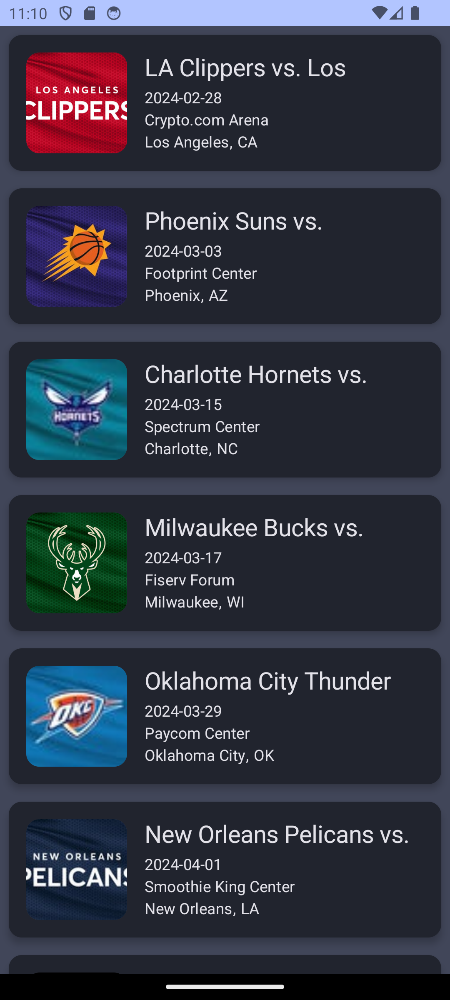

# Clean Architecture Example

This is an Android project showcasing the implementation of Clean Architecture in a modular structure with Kotlin. The project is divided into three modules: `domain`, `data`, and `app`. It utilizes HILT for dependency injection and Jetpack Compose for the user interface.

## Modules

### 1. Domain Module
Contains the business logic and entities of the application. It defines the use cases and interfaces that will be implemented in the other modules.

### 2. Data Module
Implements the data sources and repositories defined in the domain module. This module is responsible for interacting with external data, such as fetching images from the Shibe.online API.

## Libraries and Dependencies

- [HILT](https://dagger.dev/hilt/) for dependency injection.
- [Jetpack Compose](https://developer.android.com/jetpack/compose) for UI development.
- [Retrofit](https://square.github.io/retrofit/) for web API communication.
- [Kotlin Flow](https://kotlinlang.org/docs/flow.html) for handling asynchronous operations.
- [Kotlin Coroutines](https://kotlinlang.org/docs/coroutines-overview.html) for asynchronous programming.
- [Coil](https://coil-kt.github.io/coil/) for loading and displaying images.

## External API

The sample project fetches images from the [Shibe.online API](https://shibe.online/api/). The images are displayed in a grid using Jetpack Compose.

## Screenshot

## Testing

Both the `domain` and `data` modules include tests using the following frameworks:

- [Kotlin Test](https://kotlinlang.org/api/latest/kotlin.test/) for writing tests in Kotlin.
- [MockK](https://mockk.io/) for mocking objects in tests.

## Requirements

- JDK 19 is required to build and run the project.

## Getting Started

1. Clone the repository: `git clone https://github.com/reul/CleanArchitectureExample.git`
2. Open the project in Android Studio or your preferred IDE.
3. Build and run the app on an emulator or physical device.

Feel free to explore and modify the code to understand how Clean Architecture is implemented in this project.

## License

This project is licensed under the [Unlicense](LICENSE).

## Acknowledgments

Special thanks to the [Shibe.online](https://shibe.online/) API for providing adorable images of Shiba Inu dogs.

---

Enjoy exploring and experimenting with Clean Architecture in Android with this example project! If you have any questions or feedback, please feel free to open an issue or contribute to the project.
